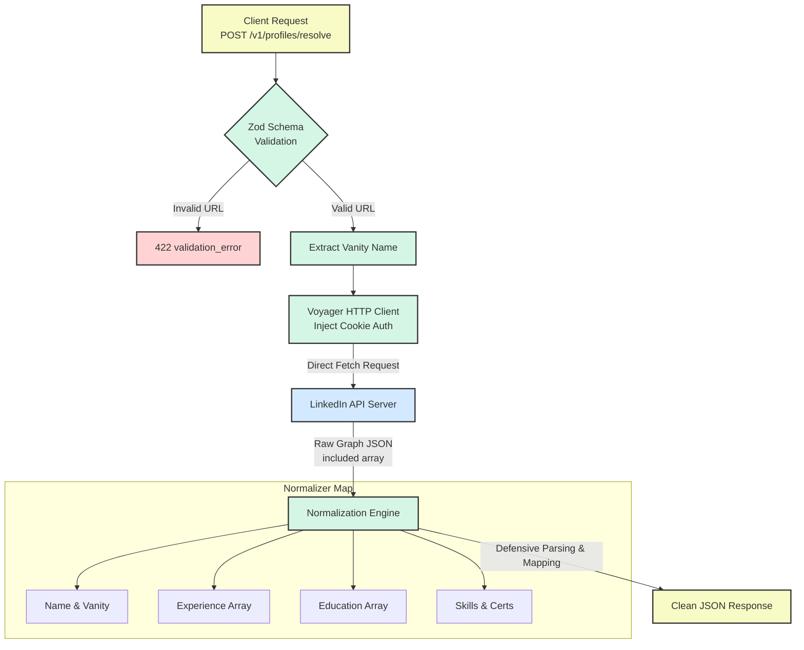
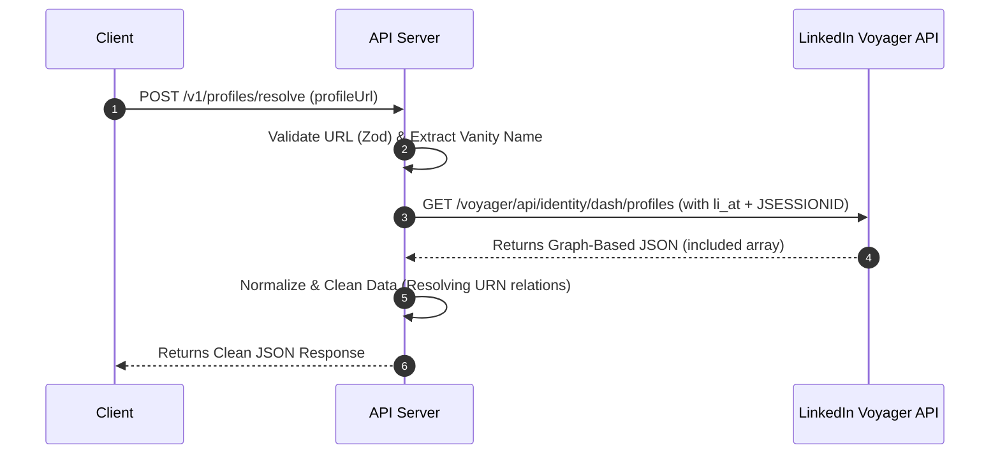

# 🔗 LinkedIn Profile Resolver API

<p align="center">
  <a href="https://trosslinkedinprofileapi.jayanthmurala.com/" target="_blank">
    
  </a>
  
  
  
  
  
  
</p>

A reverse-engineered, high-performance API that accepts a public LinkedIn profile URL and returns fully structured JSON profile data. 

Built using **Fastify**, **TypeScript**, and **Zod**, this project directly communicates with LinkedIn's internal HTTP endpoints without using a bloated headless browser (like Puppeteer or Playwright), making it lightweight, fast, and easy to deploy.

> [!NOTE]
> This project is built as a hiring challenge solution. It demonstrates secure session reuse, defensive data normalization, and production-grade API architecture.

---

## 🚀 Key Features

*   **⚡ 100% Browserless**: Direct HTTP communications with LinkedIn endpoints (highly resource-efficient).
*   **🛡️ Production-Grade Security**: Includes CORS, Helmet security headers, and global rate limiting.
*   **📐 Fully Type-Safe**: Implemented end-to-end in TypeScript with strict Zod validation.
*   **📖 Self-Documenting**: Interactive OpenAPI/Swagger documentation exposed at `/docs`.
*   **🐳 Production Ready**: Out-of-the-box Docker configuration and simple Render deployment paths.
*   **🧩 Resilient Normalization**: Defensive parsing logic that maps complex LinkedIn Voyager payloads into clean, stable JSON.

---

## 🛠️ The Approach & Pipeline

LinkedIn does not provide a public, unauthenticated API to retrieve profile details. This service simulates the network layer of the official LinkedIn web application by reusing an active authenticated browser session.

### 📐 Request Pipeline & Architecture



### ⏱️ Sequence Diagram



---

## 💻 Local Quick Start

### 1. ⚙️ Install Dependencies
```bash
npm install
```

### 2. 🔑 Configure Environment Secrets
Create a `.env` file from the template:
```bash
copy .env.example .env
```

Open `.env` and fill in your LinkedIn browser cookies:
1. Log in to **LinkedIn.com** on your browser.
2. Open DevTools (`F12`) and navigate to the **Application** (Chrome/Edge) or **Storage** (Firefox) tab.
3. Under **Cookies**, select `https://www.linkedin.com`.
4. Copy the values of:
   *   `li_at` $\rightarrow$ `LINKEDIN_LI_AT`
   *   `JSESSIONID` $\rightarrow$ `LINKEDIN_JSESSIONID` (excluding the surrounding quotes if copied with them)

> [!IMPORTANT]
> Keep your `.env` file secret. It contains credentials that provide API access to your LinkedIn account. The project is configured with a `.gitignore` to prevent committing it.

### 3. 🚀 Run the Server
```bash
# Development Mode (hot reloading)
npm run dev

# Production Mode
npm run build
npm start
```

---

## 🧪 Quality & Tests

To run the test suite and type checking:
```bash
# Run unit & integration tests (Vitest)
npm test

# Run TypeScript static typechecking
npm run typecheck
```

---

## 🐳 Docker Deployment

You can build and run the application locally inside a Docker container:

```bash
# Build the production image
docker build -t linkedin-profile-api .

# Run the container (injects your local .env)
docker run --rm -p 3000:3000 --env-file .env linkedin-profile-api
```

---

## ☁️ Public HTTPS Deployment (Render)

This service is fully prepared for hosting on cloud providers like **Render**.

### 📦 Option 1: Native Node.js Web Service
1. **Create a new Web Service** on Render and link your GitHub repository.
2. Configure the following **Environment Settings**:
   *   **Runtime**: `Node`
   *   **Build Command**: `npm install && npm run build`
   *   **Start Command**: `npm start`
3. Add these **Environment Variables**:
   *   `NODE_ENV`: `production`
   *   `LINKEDIN_LI_AT`: *(your li_at cookie)*
   *   `LINKEDIN_JSESSIONID`: *(your JSESSIONID cookie)*
   *   `ALLOWED_ORIGINS`: *(optional, comma-separated list of frontends allowed to query the API)*

### 🐋 Option 2: Dockerized Web Service
1. **Create a new Web Service** on Render and link your repository.
2. Render automatically detects the `Dockerfile` in the root.
3. Configure the following **Environment Settings**:
   *   **Runtime**: `Docker`
4. Add these **Environment Variables**:
   *   `LINKEDIN_LI_AT`: *(your li_at cookie)*
   *   `LINKEDIN_JSESSIONID`: *(your JSESSIONID cookie)*

---

## 📖 API Documentation

Once the server is running, visit **`http://localhost:3000/docs`** to view the interactive Swagger/OpenAPI documentation.

### Endpoints

| Method | Path | Target | Description |
| :--- | :--- | :--- | :--- |
| `GET` | `/health` | Operations | Check API container liveness. |
| `GET` | `/ready` | Operations | Check API readiness and verify if LinkedIn session cookies are configured. |
| `POST` | `/v1/profiles/resolve` | Profiles | Resolve a public LinkedIn URL to structured JSON. |

### Resolve Profile Payload Schema

**Request Body (`POST /v1/profiles/resolve`)**
```json
{
  "profileUrl": "https://www.linkedin.com/in/williamhgates"
}
```

**Response Format (Cleaned JSON)**
```json
{
  "data": {
    "source": "linkedin",
    "profileUrl": "https://www.linkedin.com/in/williamhgates",
    "vanityName": "williamhgates",
    "identity": {
      "id": "urn:li:fsd_profile:...",
      "firstName": "Bill",
      "lastName": "Gates",
      "fullName": "Bill Gates",
      "avatarUrl": "https://media.licdn.com/..."
    },
    "headline": "Co-chair, Bill & Melinda Gates Foundation",
    "location": "Seattle, Washington, United States",
    "about": "Co-chair of the Bill & Melinda Gates Foundation...",
    "experience": [
      {
        "title": "Co-chair",
        "company": "Bill & Melinda Gates Foundation",
        "location": "Seattle, WA",
        "description": "Guided foundation strategy...",
        "startDate": "2000-01",
        "endDate": null,
        "isCurrent": true
      }
    ],
    "education": [
      {
        "school": "Harvard University",
        "degree": "None",
        "fieldOfStudy": "Pre-Law/Computer Science",
        "description": null,
        "startDate": "1973",
        "endDate": "1975"
      }
    ],
    "skills": ["Software Development", "Philanthropy"],
    "certifications": [],
    "languages": []
  },
  "requestId": "fd7d32c5-842e-4b68-b80c-a9a7a977efd5"
}
```

---

## ⚠️ Known Limitations & Engineering Trade-offs

> [!WARNING]
> Because this is a reverse-engineered solution targeting internal APIs, keep the following limits in mind:

*   **Cookie Lifetime**: The session cookie (`li_at`) will invalidate if you change your LinkedIn password or if LinkedIn triggers a security risk checkpoint on the host account. Refresh the cookies in the environment when you receive a `linkedin_session_expired` error.
*   **Data Visibility**: The API can only retrieve profile information visible to the account whose cookies are used (based on network degree and privacy settings).
*   **Throttling**: High-volume, rapid requests can trigger LinkedIn rate limits or challenge walls. We have built-in rate-limiting on this API (60 req/min) to prevent abuse.
*   **Endpoint Drift**: LinkedIn internal endpoints can change at any time. Our parser uses defensive mapping to gracefully handle omitted or altered keys without crashing.

---

## 📂 Project Structure

```text
src/
  ├── config/
  │    └── env.ts       # Environment variable validation (Zod)
  ├── lib/
  │    ├── errors.ts    # Application custom error class
  │    └── linkedin.ts  # Voyager endpoint request & JSON normalization
  ├── schemas/
  │    └── profile.ts   # Input validation (URL check) & Type definitions
  ├── app.ts            # Fastify app setup (CORS, Rate limits, Swagger, Routes)
  └── server.ts         # Server start command
test/
  └── app.test.ts       # App endpoints & normalizer integration tests
```
